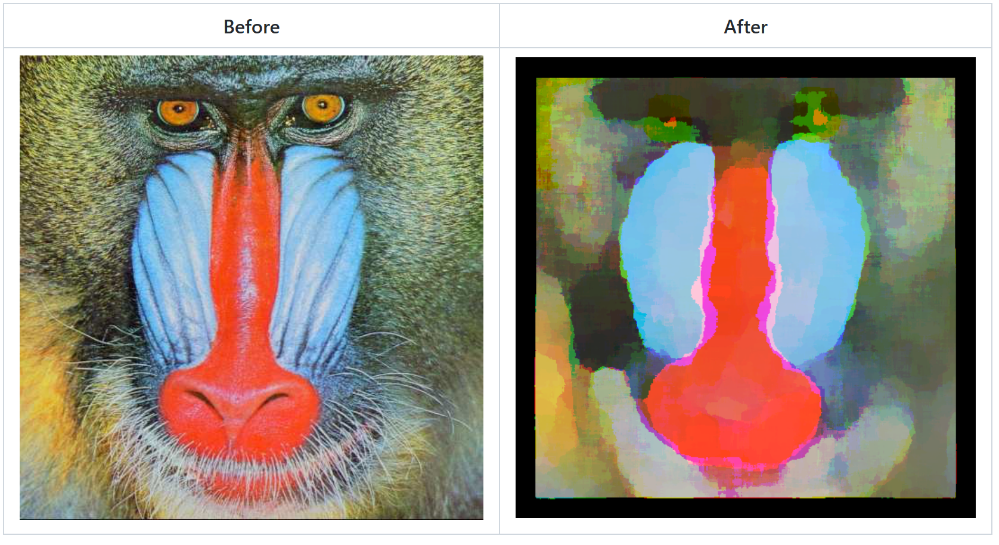

# Majority-filter

Majority filter (also called mode filter) is a nonlinear filter that picks up the most frequently occouring pixel values within the specified filter window. If multiple values has the majority the lowest pixel value is chosen. This "smearing" effect on the image.

Algorithm implementation source: [Median Filtering in Constant Time](https://ieeexplore.ieee.org/document/4287006)
